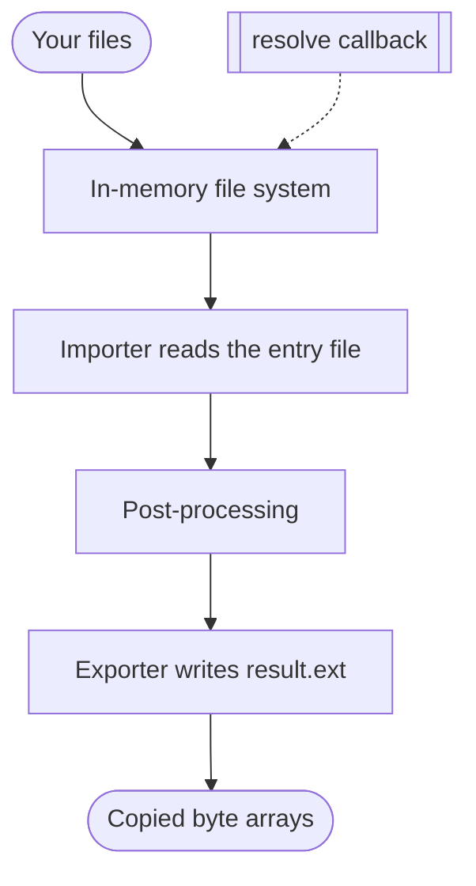

libassimp is a thin TypeScript surface over the Open Asset Import Library
compiled to WebAssembly. Everything that decides a byte happens inside that
engine; the JavaScript loads the binary, hands over the files, and copies the
result back out.

## One conversion, end to end



The files you pass become an in-memory file system inside the module — no
temporary directory, no disk. Anything the importer asks for that is not in
that set goes to your `resolve` callback, which is why the callback is
synchronous: assimp asks for a reference in the middle of parsing and cannot
wait for a promise.

The importer that matches the entry file reads it, post-processing normalises
the scene, and the exporter for the `to` id writes into the same in-memory
file system. Its output is copied into fresh `Uint8Array`s before it crosses
into JavaScript, so the result stays valid after the module grows its heap and
holds no handle back into WebAssembly.

<ConvertDemo>

```typescript
import { convert } from 'libassimp';

import { readFile } from 'node:fs/promises';

const bytes = new Uint8Array(await readFile('cube.obj'));
const { files } = await convert({ name: 'cube.obj', bytes }, { to: 'assjson' });

console.log(files[0].name, files[0].bytes.byteLength);
```

</ConvertDemo>

## Post-processing

Every conversion runs the same four assimp steps: `Triangulate`,
`GenUVCoords`, `JoinIdenticalVertices` and `SortByPType`. Together they turn
arbitrary polygon soup into indexed triangles with usable texture
coordinates, which is what the exporters and downstream viewers expect. The
set is fixed in 0.1.0; a `postProcess` option is an additive 0.2.0 change.

## What each build carries

Three entries wrap the same binding around a different set of compiled-in
formats. Read the tables as the answer to one question: can this import
specifier do my conversion?

### Exporters

A `to` id from this table is what `convert` accepts. The output file is named
after the extension, so `step` writes `result.stp` and `assjson` writes
`result.json`.

<ExportMatrix />

Six friendly aliases sit on top: `glb` and `gltf` name glTF 2.0 (assimp's
`glb2` and `gltf2`), `glb1` and `gltf1` reach glTF 1.0, `step` resolves to
`stp`, and `dae` to `collada`. Naming an id the build does not carry fails
with `UNSUPPORTED_FORMAT`, and the message lists the ids it does.

### Importers

The entry file's extension picks the importer, so this table is a list of what
each build can read.

<ImportMatrix />

## Why the binaries are the size they are

The engine is compiled and linked with `-O3 -DNDEBUG`, then the module goes
through standalone `wasm-opt -O4 --converge --traps-never-happen`. Binaryen's
size-only `code-folding` pass is skipped because it consumed 99.4% of a
measured 4,348-second full link on web-ifc's generated schema function without
adding a runtime optimisation. The build also uses mimalloc, Closure-compiled
glue (`--closure=1`), `-sEVAL_CTORS=2` to run static constructors at build time,
and `-fwasm-exceptions`, which is native WebAssembly exception handling rather
than the JavaScript-based emulation assimp's error paths would otherwise pay
for on every call. `-msimd128` turns on the fixed-width SIMD every supported
browser and Node.js release implements.

Three things are deliberately off. Link-time optimisation costs size on this
codebase for no measured gain. Relaxed SIMD would trade byte-exact results
across hosts for speed, and identical output on every host is worth more than
the difference. Threads would demand cross-origin isolation headers from every
page that loads the module, for an engine that parses one file at a time.

Every binary carries a byte ceiling in continuous integration: raw, gzip and
brotli sizes are asserted on each build, and a ceiling only moves in the change
that causes it to move. The sizes on the [home page](/) are measured from the
same artifacts, not typed in by hand.
