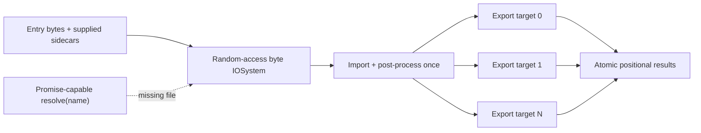
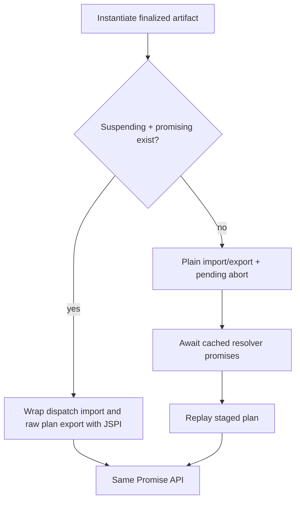

## One plan

The custom IOSystem exposes named in-memory byte arrays through Assimp's random-access `Read`, `Seek`, and `Tell` contract. It is not Emscripten MEMFS: there is no path mount, duplicate filesystem copy, or public filesystem lifetime. A generic stream cannot replace it because importers seek, probe, and reopen sidecars.

`convertFormats` validates the whole request, copies inputs once, imports and post-processes one scene, then exports targets sequentially into isolated output stores. A later failure destroys all native output state and rejects with positional context. Singular `convert` creates a one-target plan and unwraps the same result path.

## Async resolution with one artifact

The package ships one baseline-compatible `libassimp.wasm` artifact:

The replay cache is per conversion and invokes the consumer resolver once per exact name. Each pending attempt stops host callbacks immediately, awaits newly discovered work, and reuses settled bytes on the next attempt. JSPI-capable Chromium suspends inside parsing instead. Both paths use the same final SHA and have exact output, resolver-trace, and error parity tests.

Each `Assimp` instance serializes singular and plural work through one rejection-safe FIFO queue. Separate instances are the parallelism boundary. `dispose()` rejects new calls and releases the runtime after queued work settles.

## Canonical formats

Public targets are not Assimp exporter IDs. `glb` and `gltf` always route to glTF 2; `dae` and `step` are canonical names; FBX/PLY/STL encoding uses `exportOptions.binary`; OBJ sidecar behavior uses `exportOptions.materials` and defaults to materials.

<ExportMatrix />

The import table is directional: it lists readable extensions, not writable targets.

<ImportMatrix />

`assimpCapabilities`, the instance `formats` tables, `conversionEdges`, TypeScript unions, validation, and these matrices come from one checked-in compiler-derived registry. Native names never enter the public catalog.

## Post-processing

`defaultPostProcess` is `Triangulate`, `GenUVCoords`, `JoinIdenticalVertices`, and `SortByPType`. Supplying `postProcess` is an exact replacement. `assimpCapabilities.postProcess` publishes every supported named step, bit value, description, and conflict.

## Production build

The artifact compiles and links with `-O3 -DNDEBUG`, fixed SIMD, mimalloc, Wasm exceptions, Closure-compiled glue, constructor evaluation, and standalone `wasm-opt -O4 --converge --traps-never-happen --skip-pass=code-folding`. The build explicitly pins `WASM_LEGACY_EXCEPTIONS=1`; exnref waits until every documented host floor supports it. LTO, relaxed SIMD, pthreads, Asyncify, and mode-specific JSPI artifacts remain absent.

The build manifest records exact definitions, compile/link/optimizer flags, import/export inventory, and raw/gzip/brotli size. CI ratchets those measured files rather than estimating them.
